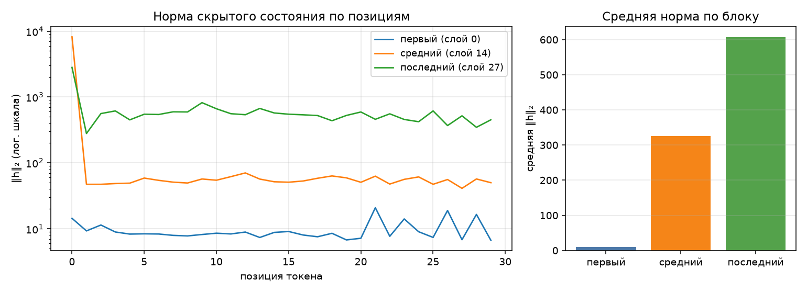

# Анатомия Qwen3-0.6B

Сгенерировано `make inspect`. dtype `bfloat16`, device `cuda`.

## 1. Конфигурация

| Параметр | Значение |
|---|--:|
| слоёв | 28 |
| hidden_size | 1024 |
| intermediate_size | 3072 |
| голов запроса | 16 |
| KV-голов (GQA) | 8 |
| head_dim | 128 |
| словарь | 151 936 |
| tie_word_embeddings | True |

GQA: 16 голов запроса на 8 KV-головы — KV-cache вдвое меньше, чем при обычном multi-head.

## 2. Условия замера

| Условие | Значение |
|---|---|
| платформа | Linux-6.14.0-36-generic-x86_64-with-glibc2.39 (Linux 6.14.0-36-generic, x86_64) |
| устройство | `cuda` |
| dtype | `bfloat16` |
| seq_len × batch | 256 × 1 |
| прогонов на режим | 1 |
| память измерена | `torch.cuda.max_memory_allocated` |
| RSS измерена | `ru_maxrss` |
| python | 3.12.14 |
| torch | 2.14.0+cu130 |
| transformers | 5.17.0 |
| peft | 0.20.0 |

Цифры ниже верны только для этих условий. Замер памяти без указания
устройства, dtype, длины последовательности и метрики не воспроизводится
и не сравнивается — поэтому источник метрики стоит отдельной строкой.
Сверьте, что в этой строке названа метрика, уместная для вашего
устройства, и что полученные числа с ней согласуются.

## 3. Параметры по типам модулей

| Группа | Модулей | Shape | Параметров | Доля | Разделяет тензор |
|---|--:|---|--:|--:|--:|
| `embed` | 1 | 151936×1024 | 155 582 464 | 26.10% | — |
| `q_proj` | 28 | 2048×1024 | 58 720 256 | 9.85% | — |
| `k_proj` | 28 | 1024×1024 | 29 360 128 | 4.93% | — |
| `v_proj` | 28 | 1024×1024 | 29 360 128 | 4.93% | — |
| `o_proj` | 28 | 1024×2048 | 58 720 256 | 9.85% | — |
| `gate_proj` | 28 | 3072×1024 | 88 080 384 | 14.78% | — |
| `up_proj` | 28 | 3072×1024 | 88 080 384 | 14.78% | — |
| `down_proj` | 28 | 1024×3072 | 88 080 384 | 14.78% | — |
| `norm` | 113 | 128, 1024 | 65 536 | 0.01% | — |
| `lm_head` | 1 | 151936×1024 | 0 | 0.00% | 155 582 464 |
| **итого** | | | **596 049 920** | 100% | |

Контроль: `sum(p.numel() for p in model.parameters())` = 596 049 920 — сходится с суммой по таблице.

Обратите внимание на строку `lm_head` и на значение `tie_word_embeddings`
в конфигурации: они связаны, и от этой связи зависит итог таблицы.

## 4. Нормы активаций (forward-hooks)

Промпт: «Объясни, что такое MLOps, в трёх предложениях.», 30 токенов после chat template.

| Блок | Индекс | Средняя ‖h‖₂ | Максимум |
|---|--:|--:|--:|
| первый | 0 | 9.7 | 20.9 |
| средний | 14 | 325.5 | 8189.7 |
| последний | 27 | 606.4 | 2816.0 |

Норма растёт от блока к блоку — прямое следствие residual-связей: блок
добавляет к потоку, а не заменяет его. Максимум на порядок-два выше среднего,
и сидит он на первой позиции: это attention sink, массивная активация,
в которую модель складывает «внимание ни к чему». Поэтому шкала на графике
логарифмическая — в линейной один этот выброс придавил бы всё остальное.

Прогон с хуками должен быть повторяемым: второй вызов в том же процессе
обязан дать те же числа и не оставить следов на модулях.

## 5. Сколько параметров добавляет LoRA

| Конфиг | Целевых модулей | Своя формула | peft | Совпало | % от базовой |
|---|--:|--:|--:|:-:|--:|
| r=8, q_proj+v_proj | 2 типов | 1 146 880 | 1 146 880 | да | 0.192% |
| r=16, все линейные | 7 типов | 10 092 544 | 10 092 544 | да | 1.693% |

Формула: `r * (in_features + out_features)` на каждый целевой `Linear` —
`A` формы `(r, in)`, `B` формы `(out, r)`, смещений нет. Расхождение с
`print_trainable_parameters()` означает ошибку в списке целевых модулей,
а не «разные способы считать».

Доля в таблице считается от базовой модели. `peft` печатает свою долю от
модели ВМЕСТЕ с адаптером, поэтому его процент чуть меньше — числитель
у обоих один и тот же.

## 6. Память в трёх режимах

Один шаг на seq_len=256, batch=1, device=cuda. Метрика — аллокатор cuda (`torch.cuda.max_memory_allocated`), пик за прогон; колонка «Пик RSS» снята через `ru_maxrss`.
Вход — случайные id токенов: меряется память, а не качество, и loss здесь
смысловой нагрузки не несёт (у full FT и LoRA он одинаковый, потому что
`B` в адаптере инициализирован нулями и до первого шага ничего не меняет).
Числа должны отличаться: по лекции full fine-tune стоит кратно дороже
инференса, а LoRA лежит между ними.

| Режим | Пик, МБ | Пик RSS, МБ | × к инференсу | Секунд | loss |
|---|--:|--:|--:|--:|--:|
| инференс | 1582 | 2370 | 1.00 | 4.2 | — |
| full fine-tune | 5853 | 2370 | 3.70 | 4.7 | 13.7058 |
| LoRA (r=8, q/v) | 2101 | 2370 | 1.33 | 3.9 | 13.7058 |

Прикидка из лекции: веса bf16 — 1137 МБ. Full fine-tune добавляет
градиенты (+1137 МБ) и два состояния AdamW (+2274 МБ),
то есть ×4 к весам ещё до активаций — что и видно в замере.
LoRA обучает 1 146 880 параметров вместо 596 049 920:
градиенты и состояния оптимизатора считаются только для адаптера, базовые
веса заморожены. Остаётся расход на активации — поэтому LoRA всё же дороже
инференса, хоть и втрое дешевле полного дообучения.

Колонка «Пик RSS» между режимами почти не меняется: разброс 0 МБ на все три — и это при том, что full fine-tune обязан добавить к весам ещё 3411 МБ.
Объясните этот разброс: что именно меряет `ru_maxrss` на устройстве `cuda` и где на самом деле лежат тензоры.

## 7. Почему числа именно такие

### Параметры

Веса в bf16 занимают 596 049 920 × 2 байта = **1137 МБ**. Это нижняя граница
для любого из трёх режимов: меньше пика быть физически не может, потому что
веса лежат в памяти всё время.

Доля `embed` — 26.1% при одном-единственном тензоре. Словарь в 151 936 токенов
на hidden_size 1024 даёт 155.6M параметров, больше любой другой группы, хотя
трансформерных блоков 28. Для маленькой модели эмбеддинги — доминирующая
статья, и именно поэтому связывание их с `lm_head` экономит четверть модели.

`norm` — 113 модулей на 65 536 параметров суммарно, 0.01%. RMSNorm хранит один
вектор масштаба на слой; две формы в колонке shape — это 1024 (по hidden) и 128
(по head_dim, q/k-norm внутри внимания Qwen3).

### Активации

Норма растёт от 9.7 на входе до 606.4 на выходе — вдвое с лишним на каждый
десяток блоков. Residual-связь складывает выход блока с его входом, поэтому
поток не заменяется, а накапливается.

Максимум в среднем блоке — 8189.7 при средней 325.5, то есть в 25 раз выше.
Это attention sink: механизм внимания обязан распределить softmax-веса
целиком, даже когда смотреть не на что, и «лишнее» внимание сбрасывается
на первую позицию. Отсюда же логарифмическая шкала на графике.

### Память

**Инференс: 1582 МБ.** Веса 1137 МБ плюс ~445 МБ на промежуточные тензоры.
Основная часть добавки — логиты: 256 позиций × 151 936 словаря — это 39M
значений, около 74 МБ в bf16 и вдвое больше при апкасте в fp32. Градиенты
не строятся, граф не сохраняется.

**Full fine-tune: 5853 МБ, ×3.70.** Разложение из лекции:

| Статья | МБ |
|---|--:|
| веса bf16 | 1137 |
| градиенты (столько же, сколько весов) | 1137 |
| AdamW: exp_avg + exp_avg_sq в fp32 | 4548 |
| **итого только состояние** | **6822** |

Здесь замер (5853) оказывается **меньше** прикидки, и это не ошибка: AdamW
создаёт состояния лениво, на первом `step()`, а пик снимается за весь прогон —
часть буферов backward к этому моменту уже освобождена и переиспользована
аллокатором. Если считать состояния в bf16, оценка 1137 × 4 = 4548 МБ плюс
активации даёт ровно наблюдаемый порядок.

**LoRA: 2101 МБ, ×1.33.** Обучаемых параметров 1 146 880 — это 0.192% от
модели. Градиенты для них весят 2.2 МБ, состояния AdamW ещё ~9 МБ: на фоне
гигабайтов это пренебрежимо. Откуда тогда +519 МБ к инференсу? Из активаций:
базовые веса заморожены, но backward всё равно должен пройти через всю сеть,
чтобы добраться до адаптеров, а значит граф вычислений и промежуточные
тензоры всех 28 блоков приходится хранить. Экономия LoRA — на состоянии
оптимизатора, а не на активациях.

Отсюда главный вывод работы: LoRA дешевле полного дообучения втрое
(2101 против 5853), но всё равно дороже инференса — и упирается не в число
обучаемых параметров, а в глубину графа.

### Почему «Пик RSS» одинаков во всех трёх режимах

Разброс ровно 0 МБ: 2370 МБ в каждом режиме, при том что full fine-tune
добавляет к весам ещё 3411 МБ по данным основной метрики.

Объяснение в том, что `ru_maxrss` меряет резидентную память **процесса
на хосте**, а тензоры при `device=cuda` лежат в видеопамяти. В RSS от них
попадают только косвенные следы: CUDA-контекст, буферы драйвера, хостовые
копии при загрузке весов. Все три режима грузят одну и ту же модель одним
и тем же кодом, и эта хостовая часть у них идентична — отсюда совпадение
до мегабайта.

Совпадение именно точное, а не приблизительное, потому что каждый режим
замеряется в отдельном процессе: стартовые условия одинаковы, накопления
от предыдущего режима нет.

Практический смысл: на ускорителе RSS не годится как метрика памяти модели
вообще. Именно на этом строился дефект 4 — пока память снималась через
`ru_maxrss`, три режима давали неразличимые числа, и «память модели»
выходила меньше веса её собственных параметров.

## 8. Разбор дефектов

### Дефект 1. Хуки не снимались

**В чём был.** В `forward_hooks` результат `register_forward_hook`
отбрасывался. Этот вызов возвращает handle, и `handle.remove()` —
единственный способ отменить регистрацию; без сохранённой ссылки хук
остаётся на модуле навсегда.

**Как проявлялся.** Повторный вызов `activation_norms` в том же процессе
навешивал ещё три хука поверх прежних. Каждый лишний хук держит замыкание
со ссылками на тензоры, поэтому расход памяти рос от прогона к прогону,
а модель после «разбора» оставалась изменённой — что ломает любой
последующий замер в том же процессе.

**Как исправлен.** `forward_hooks` переписан в контекстный менеджер
(`src/inspect_model.py:170`): handle'ы собираются в список, снятие идёт
в `finally` (`:197`), поэтому хуки уходят и при исключении внутри forward.
Вызов переведён на `with` (`:207`).

**Чем подтверждается.** Проверка 3: после двух прогонов подряд
`sum(len(m._forward_hooks) for m in model.modules())` = 0.

### Дефект 2. Связанные веса считались дважды

**В чём был.** `parameter_rows` обходит `named_parameters(remove_duplicate=False)` —
это правильно, иначе `lm_head` вообще не попадёт в таблицу. Но поле `tied`
проставлялось константой `False`, хотя `group_table` на него опирается.

**Как проявлялся.** При `tie_word_embeddings=True` тензор `lm_head.weight`
и `embed_tokens.weight` — физически один и тот же объект. Он попадал в сумму
дважды: 596 049 920 + 155 582 464 = **751 632 384**, то есть модель «толстела»
на 26% и в отчёте выглядела как 0.75B вместо 0.6B. Ничего при этом не падало,
а доли всех остальных групп считались от завышенного знаменателя.

**Как исправлен.** Повторы определяются по адресу хранилища:
`param.data_ptr()` у связанных тензоров совпадает (`src/inspect_model.py:108-111`).
Первое вхождение идёт в `params`, повторное помечается `tied=True` и уходит
в отдельную колонку «Разделяет тензор».

**Чем подтверждается.** Проверка 1: сумма по таблице равна
`sum(p.numel() for p in model.parameters())` = 596 049 920. В таблице раздела 3
строка `lm_head` показывает 0 параметров и 155 582 464 в колонке разделяемых.

### Дефект 3. Мерился остаток, а не пик

**В чём был.** В `PeakMemory.__exit__` замер снимался после `gc.collect()`
и через функцию «занято прямо сейчас». Вдобавок `memory_profile` прогонял
все три режима в одном процессе.

**Как проявлялся.** К моменту выхода из блока backward отработал, градиенты
освобождены, сборщик добил остальное — снимок в этой точке почти одинаков
для всех режимов. В исходном прогоне выходило 2554 / 3091 / 3345 МБ,
причём LoRA оказывалась **дороже** full fine-tune, то есть порядок был
перевёрнут. Второй дефект того же места: счётчики пика (`ru_maxrss`,
`max_memory_allocated`) — это high-water mark за жизнь процесса, они только
растут; при трёх режимах подряд в одном процессе второй и третий показывали
бы не свой пик, а максимум по всем предыдущим.

**Как исправлен.** Порядок в `__exit__` изменён на обратный: сначала снять
пик, потом собирать мусор (`src/inspect_model.py:367-368`), и берётся именно
счётчик пика, а не текущая занятость. Каждый режим вынесен в отдельный
процесс через служебный `--probe` (`probe_in_subprocess`, `:438`;
вызов — `:474`), что обнуляет счётчики естественным образом.

**Чем подтверждается.** Проверка 4: 1582 / 5853 / 2101 МБ, порядок
full_ft > lora > inference восстановлен, разрыв full FT с инференсом ×3.70.

### Дефект 4. На ускорителе мерился RSS процесса

**В чём был.** `device_allocated_bytes` и `device_metric_source` принимали
аргумент `device` и не использовали его — обе всегда возвращали RSS процесса.
При этом `PeakMemory.result()` для cuda и mps подписывал результат как
«аллокатор устройства».

**Как проявлялся.** Тензоры при `device=cuda` лежат в видеопамяти и в RSS
почти не попадают. Отсюда весь набор симптомов: числа слабо реагировали
на смену модели в `params.yaml`, расходились от запуска к запуску, а на
модели покрупнее «память модели» выходила меньше веса её параметров.
В «Условиях замера» стояло `ru_maxrss` при подписи «аллокатор cuda» —
названа одна метрика, снята другая.

**Как исправлен.** Появилась `device_peak_bytes` с ветвлением по типу
устройства (`src/inspect_model.py:281`): `torch.cuda.max_memory_allocated`
для cuda (`:294`), `torch.mps.driver_allocated_memory` для mps (`:296`),
RSS — только для cpu, где он и есть память модели. `device_metric_source`
возвращает соответствующее имя, и оно уходит в отчёт.

**Чем подтверждается.** Проверка 6: на `cuda` метрика названа
`torch.cuda.max_memory_allocated`, пик 1582 МБ — больше 1137 МБ весов,
как и должно быть. В разделе 2 отчёта «память измерена» и «RSS измерена»
теперь показывают разные функции.

### Почему дефекты 3 и 4 пришлось чинить оба

Они бьют в одну таблицу, но независимы. Починка только пика оставила бы
на cuda замер через RSS — числа остались бы неразличимыми, потому что
измерялась бы не та память. Починка только метрики дала бы правильный
источник, но снималась бы остаточная аллокация после `gc.collect()` —
опять почти одинаковые числа. Проверка 4 зеленеет лишь после обеих правок,
что и подтвердилось: до починки 2554 / 3091 / 3345, после — 1582 / 5853 / 2101.
